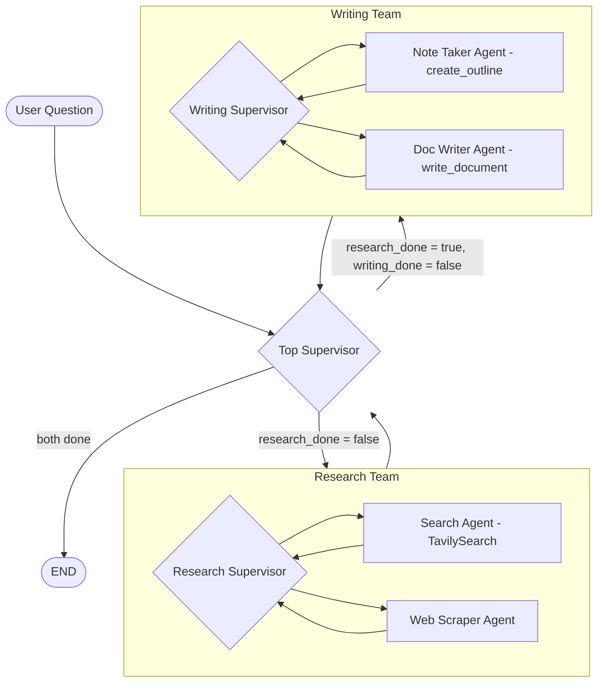

# Autonomous Research & Writing Orchestrator

Autonomous research & writing orchestrator using LangGraph supervisors, web-search/scrape agents, and document writer agents. Focus: safe, controlled multi-agent execution.

A **hierarchical multi-agent system** built with LangGraph that autonomously researches any question using live web data and produces a structured, well-written document — using a supervisor-agent pattern with specialized research and writing teams.

> **Skills demonstrated:** LangGraph · Hierarchical agent orchestration · Supervisor pattern · Tool-calling agents · Tavily web search · Multi-team coordination

---

## What It Does

Ask any question — the system autonomously:
1. **Researches** the web using a search agent + web scraper agent
2. **Writes** a structured outline via a note-taker agent
3. **Generates** a full document via a document-writer agent
4. **Saves** both `outline.txt` and `answer.txt` to disk

No manual prompting between steps. The top-level supervisor ensures research completes before writing begins.

---

## Architecture



---

## Agent Roles

| Agent | Team | Responsibility |
|-------|------|----------------|
| Search Agent | Research | Converts user question to a search query, calls TavilySearch |
| Web Scraper Agent | Research | Extracts full text content from result URLs |
| Note Taker Agent | Writing | Generates structured outline, saves to `outline.txt` |
| Doc Writer Agent | Writing | Writes full document from outline + research, saves to `answer.txt` |
| Research Supervisor | Research | Decides which research agent runs next; stops when sufficient |
| Writing Supervisor | Writing | Controls outline → write sequence |
| Top Supervisor | Global | Ensures research completes before writing; detects completion |

---

## Tech Stack

| Component           | Technology |
|---------------------|------------|
| Agent Orchestration | LangGraph (stateful graph execution) |
| Web Search          | Tavily Search API |
| LLM                 | Google Gemini (via LangChain) |
| State Management    | LangGraph shared state dict |
| Output              | File I/O (outline.txt, answer.txt) |
| Language            | Python 3.10+ |

---

## Project Structure

```
Multiagent/
├── multi_agent.py      # Full system: all agents, supervisors, graphs, and entry point
├── temp/               # Generated outputs: outline.txt, answer.txt
└── README.md
```

---

## Setup & Run

```bash
# 1. Clone and install
git clone https://github.com/gnanadeep52/Multiagent.git
cd Multiagent
pip install langgraph langchain langchain-google-genai langchain-tavily python-dotenv

# 2. Set API keys in .env
echo "GOOGLE_API_KEY=your_google_api_key" >> .env
echo "TAVILY_API_KEY=your_tavily_api_key" >> .env

# 3. Run
python multi_agent.py
```

When prompted, enter any question. The system will research, write, and print the final answer — and save files to `temp/`.

---

## Key Design Decisions

**Why a supervisor pattern instead of a linear chain?**  
A top-level supervisor can dynamically decide which team runs next and detect completion state. This is more robust than a fixed sequence — the research team can run multiple iterations before handing off to writing.

**Why separate research and writing teams?**  
Mixing research and writing in a single agent produces unstructured output. Separation ensures writing only starts when research is complete, and the note-taker’s outline constrains the writer — reducing hallucination and improving document structure.

**Why execution limits?**  
Without a step limit, LLM agents can loop indefinitely (especially supervisors). Hard limits on max iterations ensure the system always terminates predictably — a critical property in production agentic systems.

---

## References
- [LangGraph Documentation](https://langchain-ai.github.io/langgraph/)
- [LangGraph Multi-Agent Patterns](https://docs.langchain.com/oss/python/langgraph/overview)
